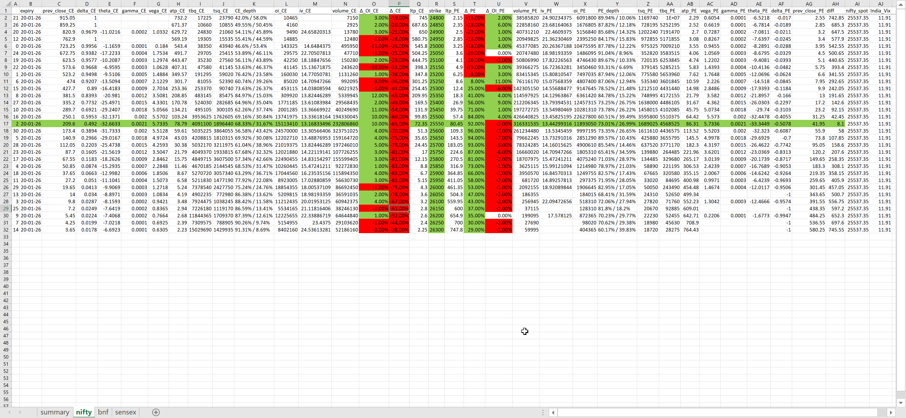

# 📊 Live Option Chain Dashboard (Python + Upstox API + Excel)

A **real-time option chain streaming system** built using **Python** and **Upstox Broker API**, with **tick-by-tick updates directly into Excel**.



This project streams live option chain data for **NIFTY, BANKNIFTY, and SENSEX**, calculates key option metrics (Greeks, IV, OI, depth, PCR), and displays everything in an Excel workbook that updates live — making it ideal for **analysis, strategy testing, and automation research**.

> ⚠️ This is a **data & analytics project**, not a trading recommendation system.

---

## 🚀 Key Features

### 🔴 Live Tick-by-Tick Updates
- Real-time option chain streaming using **Upstox WebSocket API**
- Updates Excel **without refresh or reload**
- Near zero latency (broker-dependent)

### 📈 Supported Indices
- **NIFTY 50**
- **BANKNIFTY**
- **SENSEX**

Each index has its **own Excel sheet** with synchronized updates.

---

## 🧠 Data Captured (Per Strike)

### 📌 Core Option Data
- Option Price (LTP)
- Previous Close
- Volume
- Open Interest (OI)
- Change in OI
- Bid / Ask Price
- Market Depth

### 📐 Option Greeks (Live)
- Delta
- Gamma
- Vega
- Theta
- Implied Volatility (IV)

### 📊 Derived Metrics
- OI Change %
- Price Change %
- Put-Call Ratio (PCR)
- Depth-based Strength
- Strike-wise positioning

---

## 🔄 Live Change Tracking (CE & PE)

- **Change in OI and Change in LTP** are calculated **against previous day close** for:
  - Call (CE) side
  - Put (PE) side
  - **All strikes displayed**

- Excel highlights these changes visually:
  - 🟢 **Green** → Increase / build-up
  - 🔴 **Red** → Decrease / decay

- This allows instant identification of:
  - Long build-up
  - Short build-up
  - Long unwinding
  - Short covering

📌 Works independently for **CE and PE**, strike by strike.

---

## 📍 Live Synthetic ATM Highlight

- A **dedicated horizontal highlight row** marks the **live Synthetic ATM**.
- The Synthetic ATM updates continuously as prices change.
- This row **moves automatically** with market movement, ensuring:
  - ATM is always visually centered
  - No manual scrolling is required

---

## 🎯 Dynamic ATM-Centered Strike Window

- The option chain is **always centered around the live ATM**:
  - **15 strikes above ATM**
  - **15 strikes below ATM**

- When the market moves sharply:
  - New strikes are **automatically added**
  - Out-of-range strikes are **removed**
  - The **15–ATM–15 structure is preserved at all times**

- This ensures:
  - Only the **most relevant strikes** are displayed
  - Clean and focused Excel layout
  - Accurate representation during trending or volatile markets

📌 This adjustment happens **throughout the trading day**, regardless of:
- Breakouts
- Sharp directional moves
- High volatility conditions

---

## 🧾 Excel Dashboard Structure

### 📂 Sheets
- `nifty` – NIFTY option chain
- `bnf` – BANKNIFTY option chain
- `sensex` – SENSEX option chain

---

### 🧩 Column Description (Example: NIFTY Sheet)

| Column | Description |
|------|------------|
| expiry | Option expiry date |
| prev_close_CE | Previous close (Call) |
| delta_CE | Delta (Call) |
| gamma_CE | Gamma (Call) |
| vega_CE | Vega (Call) |
| theta_CE | Theta (Call) |
| iv_CE | Implied Volatility (Call) |
| volume_CE | Traded volume (Call) |
| OI_CE | Open Interest (Call) |
| chg_OI_CE | Change in OI (Call) |
| strike | Strike price |
| ltp_CE | Last traded price (Call) |
| bid_CE | Best bid (Call) |
| ask_CE | Best ask (Call) |
| depth_CE | Market depth (Call) |
| ltp_PE | Last traded price (Put) |
| bid_PE | Best bid (Put) |
| ask_PE | Best ask (Put) |
| volume_PE | Traded volume (Put) |
| OI_PE | Open Interest (Put) |
| chg_OI_PE | Change in OI (Put) |
| iv_PE | Implied Volatility (Put) |
| delta_PE | Delta (Put) |
| gamma_PE | Gamma (Put) |
| theta_PE | Theta (Put) |
| strike_PCR | Strike-wise PCR |
| nifty_spot | Spot price |
| India_VIX | India VIX |

📌 **Color coding in Excel**
- 🟢 Green → Positive / bullish change
- 🔴 Red → Negative / bearish change

---

## 🖼 Sample Output

### Live NIFTY Option Chain (Excel)


*(BANKNIFTY and SENSEX sheets follow the same structure)*

---

## 🛠 Tech Stack

| Layer | Technology |
|-----|-----------|
| Language | Python 3.10+ |
| Broker API | Upstox API (REST + WebSocket) |
| Excel Integration | xlwings |
| Data Handling | pandas, numpy |
| WebSocket | websockets, asyncio |
| Auth | pyotp (2FA automation) |
| Visualization | Excel conditional formatting |

---

## 📦 Python Libraries Used

```text
pandas
numpy
xlwings
websockets
asyncio
upstox_client
protobuf
pyotp
matplotlib
openpyxl
